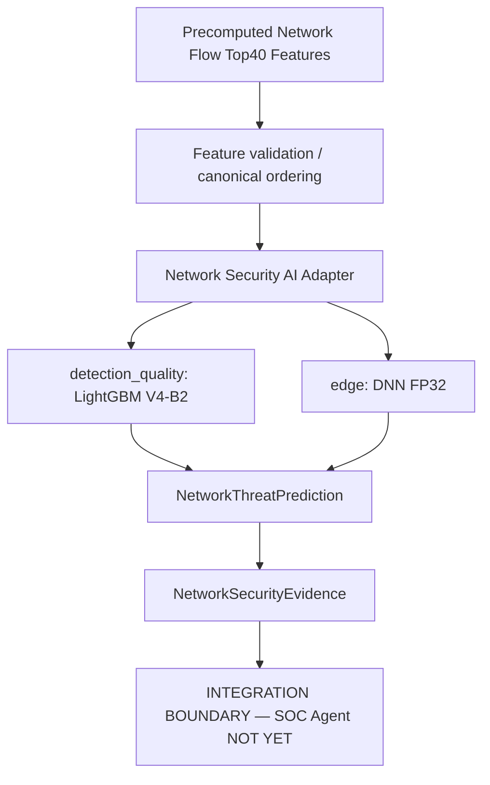

# Network Security AI — 독립 inference/evidence module

Network Security AI를 독립 inference/evidence module로 패키징했으며, DNS Security AI 완료 후 Multi-Model Evidence Fusion을 거쳐 Autonomous SOC Agent에 통합할 예정이다. 현재 SOC Agent에는 연결하지 않는다.



| Profile | Backend | CSE-CIC-IDS2018 Full Validation Macro F1 | 용도 |
|---|---|---:|---|
| `detection_quality` | LightGBM V4-B2 | 0.808655 | 서버/SOC 탐지 품질 후보 |
| `edge` | DNN FP32 epoch 13 | 0.698647 | 낮은 지연·작은 모델 후보 |

DNN의 Accuracy는 높지만 Macro F1은 LightGBM보다 낮다. 위 지표는 운영·드론 traffic 성능이 아니다. TorchAO INT8은 기존 실험으로 보존하며 이 패키지의 profile 또는 필수 dependency가 아니다. 재학습, Test V2 재평가, ensemble 또는 fusion을 수행하지 않는다.

## 설치 및 실행

별도 `pyproject.toml`을 사용하므로 ML 실험 환경이나 SOC dependency를 변경할 필요가 없다. Python 3.12 이상. ML 프로젝트 루트에서 필요한 backend만 설치한다.

```bash
uv pip install './packages/network-security-ai[detection-quality]'
# 또는
uv pip install './packages/network-security-ai[edge]'

network-security-ai --artifact-root . \
  --input packages/network-security-ai/examples/synthetic_top40.json \
  --profile detection_quality --flow-reference synthetic-demo
```

입력 예제는 feature별 0..39 값을 넣은 **합성 입력**이며 실제 flow 또는 정답 label이 아니다. CLI는 prediction과 evidence JSON만 출력한다. API:

```python
from pathlib import Path
from network_security_ai import (
    NetworkSecurityAIConfig,
    create_network_security_ai,
    prediction_to_evidence,
)

config = NetworkSecurityAIConfig(
    enabled=True,
    profile="edge",
    artifact_root=Path("."),
)
adapter = create_network_security_ai(config)
assert adapter is not None
prediction = adapter.predict(features)  # 정확히 Top40 이름을 가진 Mapping
receipt = prediction_to_evidence(prediction, flow_reference="flow-reference")
# receipt를 SOC에 보내거나 대응을 실행하는 코드는 현재 없다.
```

`enabled=False`가 기본이며 disabled factory는 artifact도 읽지 않는다. 잘못된 profile은 Pydantic validation error다. `NetworkSecurityAIAdapter`는 Protocol 기반 fake predictor도 받을 수 있다.

## Artifact / input contract

Artifact root는 호출자가 지정한다. 코드에 사용자 absolute path는 없다. root 내부 상대경로만 허용하며 symlink를 통한 root 이탈도 차단한다.

| Artifact | 기본 상대경로 |
|---|---|
| Top40 canonical order | `results/feature_selection/top40_features.csv` |
| 실제 label mapping | `data/processed/network_ml/label_mapping.json` |
| LightGBM | `models/network/lightgbm_top40_v4b2.txt` |
| DNN epoch 13 | `models/network/dnn_top40_v4_best.pt` |
| 이미 fit된 scaler | `models/network/dnn_top40_v4_scaler.joblib` |

실제 label mapping의 ID 순서를 읽으며 원래 label 철자 `Infilteration`을 보존한다. 이 패키지는 flow 추출기를 구현하지 않는다. CIC와 동일한 의미/단위의 미리 계산된 feature가 필요하다.

- 정확히 40개 key를 요구하고 caller 순서와 무관하게 CSV rank 순서로 정렬한다. 추가 key도 거부한다.
- numeric 문자열은 변환 가능하다. bool, container, nonnumeric 값 및 float32 overflow는 typed input error다.
- `None`, NaN, ±Inf는 NaN으로 정규화한다. LightGBM은 scaler 없이 native missing 처리한다.
- DNN은 canonical float32 → nonfinite NaN → scaler training mean으로 대체 → 기존 scaler.transform → float32 CPU tensor 순서다. 절대 fit하지 않는다.
- 모델 이름·feature 수·class 수 및 checkpoint feature order/epoch13, scaler shape를 검증한다. scaler의 feature names가 있으면 순서도 검증한다.

Top40와 mapping은 생성 시 한 번 읽는다. 선택한 model/scaler만 최초 predict에 lazy load하고 cache한다. Lock은 동시 최초 호출에서도 재로드를 막으며 같은 predictor의 inference를 직렬화한다. import 시 torch/lightgbm/torchao를 import하지 않는다. global torch thread 설정을 바꾸지 않는다.

`artifact_manifest.json`은 이번 확인한 5개 artifact의 SHA256을 포함한다. model/scaler 역직렬화 전에 checksum을 확인한다. 대체 bundle은 관리자 검토 후 `bundle_manifest_path`로 명시해야 한다. 이 manifest는 서명이나 공급망 인증을 대신하지 않는다. joblib은 pickle이므로 artifact root와 manifest는 신뢰하는 관리자가 관리해야 한다. 대형 모델·학습 데이터는 패키지에 복제하지 않는다.

## Output / 오류 / 로그

`NetworkThreatPrediction`은 predicted_class, class_id, 15 class probabilities, confidence, `threat_score = 1 - P(Benign)`, backend/model version, deployment profile, feature version/digest, label mapping digest, UTC inferred_at, 실제 호출 latency(ms)를 담는다. Probability는 shape·범위·합·argmax 일관성을 검증한다. Confidence/threat_score는 **미보정 모델 확률**이며 severity·실제 공격 확률·대응 권한이 아니다.

`inference_latency_ms`는 feature validation 이후 backend 구간을 측정하며 preprocessing, lock 대기 및 첫 호출 artifact load/import를 포함한다. 기존 warm-up CPU benchmark와 측정 경계가 다르므로 직접 비교하지 않는다.

`NetworkSecurityEvidence`는 prediction과 선택적인 짧은 flow_reference만 담는 frozen object다. `model_derived=True`, `confidence_calibrated=False`, `attack_confirmed=False`다. raw Top40, SOC IncidentState, approval/action fields, 실행 함수가 없다. reference에는 민감한 원본 traffic을 넣지 않는다. DNS 출력 또는 공통 fusion schema를 가정하지 않는다.

누락/손상/checksum 불일치 artifact, 잘못된 input/output, inference failure는 각각 typed error다. 조용히 Benign으로 fallback하지 않는다. API caller가 degraded operation을 처리하고 CLI는 exit 1을 반환한다. 표준 Python logging의 structured extra에 backend/version/success/latency 및 성공 시 class/confidence만 남긴다. 원본 feature나 backend exception 내용을 로그에 복제하지 않는다.

## 테스트

패키지 디렉터리에서 `uv run pytest`, `uv run ruff check .`, `uv run ruff format --check .`. Unit tests는 fake artifacts/loaders를 사용하며 실제 대형 모델이나 optional backend 설치를 요구하지 않는다. standalone flow→prediction→evidence, lazy cache, 선택 profile만 로드, artifact errors, immutable evidence의 action 거부를 검증한다. SOC pipeline/fusion 통합 테스트는 이번 범위에 없다.

## 다음 integration boundary와 한계

DNS 모델 완성 후 NetworkSecurityEvidence 및 DNSSecurityEvidence의 의미·provenance·불확실성·시간/flow 연계를 검토하고 Multi-Model Evidence Fusion을 별도 설계한다. 그 결과를 기존 ThreatAssessor → Investigation → Policy → Human Approval → Execution 흐름에 연결한다. 모델 자체에는 대응 권한을 부여하지 않는다.

실제 production traffic 검증, DNN minority-class 성능, SlowHTTP/FTP structural ambiguity, confidence calibration 미완료, 실제 embedded/ARM/NPU benchmark, CSE-CIC-IDS2018에서 drone traffic으로의 일반화 미검증이 남아 있다. V4는 Validation 중심 개발이며 Test V2는 V3에서 이미 소비했다. 새로운 독립 holdout이 필요하다.

근거: ML 루트 `results/lightgbm_top40_v4b2/`, `results/dnn_top40_v4/`, `results/ondevice_benchmark_v4/`, `scripts/benchmark_model_memory.py`, 실제 checkpoint/Booster/scaler 및 label mapping. 일부 DNN notebook이 비어 있어 scaler의 최초 fit 경로 전체를 notebook만으로 재감사할 수 없으며 기존 inference script와 artifact 구조를 기준으로 동작을 맞췄다.
