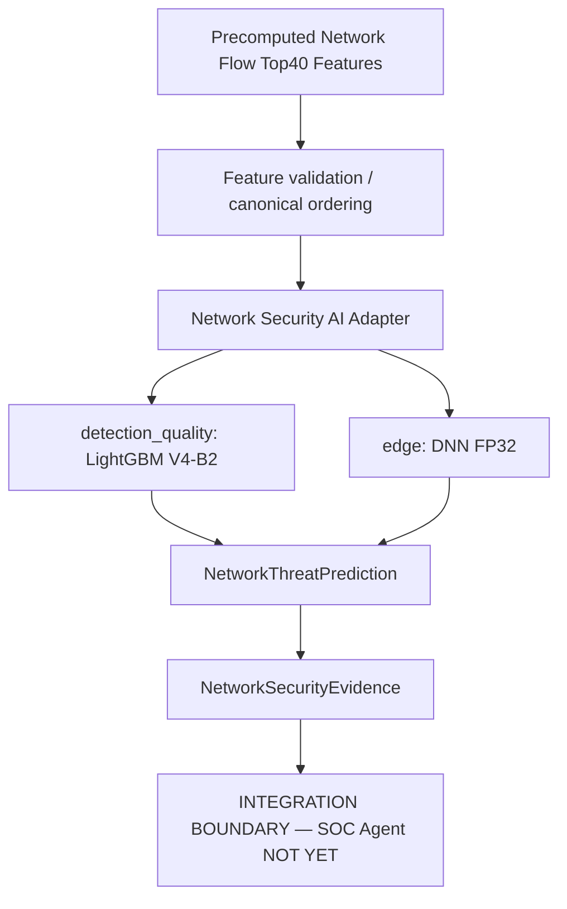

# Network Security AI — 독립 inference/evidence module

CSE-CIC-IDS2018 기반 **독립 Network Security AI inference module**입니다. ML repository만 clone하여 사용할 수 있으며 SOC Agent repository나 Python path가 필요하지 않습니다. 입력은 이미 계산된 Top40 flow features이고 출력은 prediction과 NetworkSecurityEvidence입니다. SOC 통합은 별도 작업입니다.



| Profile | Backend | CSE-CIC-IDS2018 Full Validation Macro F1 | 용도 |
|---|---|---:|---|
| `detection_quality` | LightGBM V4-B2 | 0.808655 | 서버/SOC 탐지 품질 후보 |
| `edge` | DNN FP32 epoch 13 | 0.698647 | 낮은 지연·작은 모델 후보 |

DNN의 Accuracy는 높지만 Macro F1은 LightGBM보다 낮다. 위 지표는 운영·드론 traffic 성능이 아니다. TorchAO INT8은 기존 실험으로 보존하며 이 패키지의 profile 또는 필수 dependency가 아니다. 재학습, Test V2 재평가, ensemble 또는 fusion을 수행하지 않는다.

## 설치 및 실행

패키지는 별도 `pyproject.toml`과 `uv.lock`을 사용합니다. Python 3.12 이상과 uv가 필요합니다. 아래 명령은 **ML repository 루트에서** 실행합니다. 필요한 모델 파일을 먼저 아래 경로에 배치하세요. uv는 backend dependency를 패키지 자체 환경에 설치합니다.

```bash
# 탐지 품질 profile: LightGBM
uv run --project packages/network-security-ai --extra detection-quality \
  python -m network_security_ai --artifact-root . \
  --input packages/network-security-ai/examples/synthetic_top40.json \
  --profile detection_quality --flow-reference synthetic-demo

# 작은 크기 / 낮은 latency profile: DNN FP32
uv run --project packages/network-security-ai --extra edge \
  python -m network_security_ai --artifact-root . \
  --input packages/network-security-ai/examples/synthetic_top40.json \
  --profile edge --flow-reference synthetic-demo
```

다른 위치에 모델을 두었다면 `--artifact-root /path/to/artifacts`로 지정하고 그 아래 `models/network/` 구조를 유지합니다. 설치된 환경에서는 `network-security-ai` entrypoint 또는 `python -m network_security_ai`를 사용해도 됩니다. 네트워크 없이 실행하려면 dependency가 이미 uv cache/환경에 있는 상태에서 `uv run --offline ...`을 사용합니다. 모델 다운로드나 자동 학습은 하지 않습니다.

입력 예제는 feature별 0..39 값을 넣은 **합성 입력**이며 실제 flow 또는 정답 label이 아니다. CLI는 prediction과 evidence JSON만 출력한다. API:

```python
import json
from pathlib import Path

from network_security_ai import (
    NetworkSecurityAIConfig,
    create_network_security_ai,
    prediction_to_evidence,
)

config = NetworkSecurityAIConfig(
    enabled=True,
    profile="edge",
    artifact_root=Path("."),
)
adapter = create_network_security_ai(config)
assert adapter is not None
features = json.loads(
    Path("packages/network-security-ai/examples/synthetic_top40.json").read_text()
)
prediction = adapter.predict(features)  # 정확히 Top40 이름을 가진 Mapping
receipt = prediction_to_evidence(prediction, flow_reference="flow-reference")
# receipt를 SOC에 보내거나 대응을 실행하는 코드는 현재 없다.
```

`enabled=False`가 기본이며 disabled factory는 artifact도 읽지 않는다. 잘못된 profile은 Pydantic validation error다. `NetworkSecurityAIAdapter`는 Protocol 기반 fake predictor도 받을 수 있다.

## Artifact / input contract

Artifact root는 호출자가 지정한다. 코드에 사용자 absolute path는 없다. root 내부 상대경로만 허용하며 symlink를 통한 root 이탈도 차단한다.

| Artifact | 기본 상대경로 |
|---|---|
| Top40 canonical order | package resource `resources/top40_features.csv` |
| 실제 label mapping | package resource `resources/label_mapping.json` |
| LightGBM | `models/network/lightgbm_top40_v4b2.txt` |
| DNN epoch 13 | `models/network/dnn_top40_v4_best.pt` |
| 이미 fit된 scaler | `models/network/dnn_top40_v4_scaler.joblib` |

작은 Top40 CSV와 label mapping JSON은 기존 training artifact에서 byte-identical로 복사하여 wheel/sdist에 포함했습니다. manifest checksum과 기존 fixture의 일치 여부를 테스트합니다. `data/` 또는 `results/`가 없어도 contract를 로드할 수 있습니다. 명시적으로 `top40_path`/`label_mapping_path`를 설정하면 root-relative override를 검증하며, 누락/변조된 override를 bundled resource로 조용히 대체하지 않습니다.

필요한 대형 모델은 Git에 포함하지 않습니다. 검토된 artifact bundle을 별도로 전달받거나 기존 training pipeline으로 생성하고 checksum을 확인하세요. 임의 모델을 이름만 바꿔 사용하는 것은 거부됩니다.

```text
<artifact-root>/models/network/
├── lightgbm_top40_v4b2.txt       # detection_quality
├── dnn_top40_v4_best.pt         # edge, epoch 13
└── dnn_top40_v4_scaler.joblib   # edge, fitted training scaler
```

실제 label mapping의 ID 순서를 읽으며 원래 label 철자 `Infilteration`을 보존한다. 이 패키지는 flow 추출기를 구현하지 않는다. CIC와 동일한 의미/단위의 미리 계산된 feature가 필요하다.

- 정확히 40개 key를 요구하고 caller 순서와 무관하게 CSV rank 순서로 정렬한다. 추가 key도 거부한다.
- numeric 문자열은 변환 가능하다. bool, container, nonnumeric 값 및 float32 overflow는 typed input error다.
- `None`, NaN, ±Inf는 NaN으로 정규화한다. LightGBM은 scaler 없이 native missing 처리한다.
- DNN은 canonical float32 → nonfinite NaN → scaler training mean으로 대체 → 기존 scaler.transform → float32 CPU tensor 순서다. 절대 fit하지 않는다.
- 모델 이름·feature 수·class 수 및 checkpoint feature order/epoch13, scaler shape를 검증한다. scaler의 feature names가 있으면 순서도 검증한다.

Top40와 mapping은 생성 시 한 번 읽는다. 선택한 model/scaler만 최초 predict에 lazy load하고 cache한다. Lock은 동시 최초 호출에서도 재로드를 막으며 같은 predictor의 inference를 직렬화한다. import 시 torch/lightgbm/torchao를 import하지 않는다. global torch thread 설정을 바꾸지 않는다.

`artifact_manifest.json`은 이번 확인한 5개 artifact의 SHA256을 포함한다. model/scaler 역직렬화 전에 checksum을 확인한다. 대체 bundle은 관리자 검토 후 `bundle_manifest_path`로 명시해야 한다. 이 manifest는 서명이나 공급망 인증을 대신하지 않는다. joblib은 pickle이므로 artifact root와 manifest는 신뢰하는 관리자가 관리해야 한다. 대형 모델·학습 데이터는 패키지에 복제하지 않는다.

## Output / 오류 / 로그

`NetworkThreatPrediction`은 predicted_class, class_id, 15 class probabilities, confidence, `threat_score = 1 - P(Benign)`, backend/model version, deployment profile, feature version/digest, label mapping digest, UTC inferred_at, 실제 호출 latency(ms)를 담는다. Probability는 shape·범위·합·argmax 일관성을 검증한다. Confidence/threat_score는 **미보정 모델 확률**이며 severity·실제 공격 확률·대응 권한이 아니다.

`inference_latency_ms`는 feature validation 이후 backend 구간을 측정하며 preprocessing, lock 대기 및 첫 호출 artifact load/import를 포함한다. 기존 warm-up CPU benchmark와 측정 경계가 다르므로 직접 비교하지 않는다.

`NetworkSecurityEvidence`는 prediction과 선택적인 짧은 flow_reference만 담는 frozen object다. `model_derived=True`, `confidence_calibrated=False`, `attack_confirmed=False`다. raw Top40, SOC IncidentState, approval/action fields, 실행 함수가 없다. reference에는 민감한 원본 traffic을 넣지 않는다. DNS 출력 또는 공통 fusion schema를 가정하지 않는다.

누락/손상/checksum 불일치 artifact, 잘못된 input/output, inference failure는 각각 typed error다. 조용히 Benign으로 fallback하지 않는다. API caller가 degraded operation을 처리하고 CLI는 exit 1을 반환한다. 표준 Python logging의 structured extra에 backend/version/success/latency 및 성공 시 class/confidence만 남긴다. 원본 feature나 backend exception 내용을 로그에 복제하지 않는다.

## 테스트

ML root에서:

```bash
uv run --project packages/network-security-ai pytest -q \
  -c packages/network-security-ai/pyproject.toml packages/network-security-ai/tests
uv run --project packages/network-security-ai ruff check packages/network-security-ai
uv run --project packages/network-security-ai ruff format --check packages/network-security-ai
uv build --project packages/network-security-ai --out-dir /tmp/network-security-ai-dist
```

 Unit tests는 fake artifacts/loaders를 사용하며 실제 대형 모델이나 optional backend 설치를 요구하지 않는다. standalone flow→prediction→evidence, lazy cache, 선택 profile만 로드, artifact errors, immutable evidence의 action 거부를 검증한다. SOC pipeline/fusion 통합 테스트는 이번 범위에 없다.

## 다음 integration boundary와 한계

DNS 모델 완성 후 NetworkSecurityEvidence 및 DNSSecurityEvidence의 의미·provenance·불확실성·시간/flow 연계를 검토하고 Multi-Model Evidence Fusion을 별도 설계한다. 그 결과를 기존 ThreatAssessor → Investigation → Policy → Human Approval → Execution 흐름에 연결한다. 모델 자체에는 대응 권한을 부여하지 않는다.

실제 production traffic 검증, DNN minority-class 성능, SlowHTTP/FTP structural ambiguity, confidence calibration 미완료, 실제 embedded/ARM/NPU benchmark, CSE-CIC-IDS2018에서 drone traffic으로의 일반화 미검증이 남아 있다. V4는 Validation 중심 개발이며 Test V2는 V3에서 이미 소비했다. 새로운 독립 holdout이 필요하다.

근거: ML 루트 `results/lightgbm_top40_v4b2/`, `results/dnn_top40_v4/`, `results/ondevice_benchmark_v4/`, `scripts/benchmark_model_memory.py`, 실제 checkpoint/Booster/scaler 및 label mapping. 현재 DNN/statistical/benchmark notebook은 코드가 있는 실험본입니다. 재현 순서와 Split V2/V3/V4 경계는 [pipeline 문서](../../docs/network_security_ai/reproducibility.md)를 참조하세요. Inference의 DNN architecture와 fitted-scaler preprocessing은 패키지가 관리하고 memory benchmark는 이를 import합니다. Notebook의 학습·실험 코드는 역사적 재현성을 위해 유지합니다.

## Training과 Inference의 책임

Training: CSE-CIC-IDS2018 → preprocessing → split → feature selection → LightGBM/DNN training → validation → artifact. 이 단계는 root ML 환경과 `notebooks/`를 사용하며 원본 데이터가 별도로 필요합니다.

Inference: 40 network features → contract validation → native LightGBM 또는 fitted-scaler DNN → NetworkThreatPrediction → NetworkSecurityEvidence. 학습 데이터나 SOC repository는 필요하지 않습니다. raw packet/flow feature extraction, DNS 모델, Evidence Fusion, ThreatAssessor, Investigation, Policy, Approval, Execution은 이 패키지의 구현 범위가 아닙니다.
